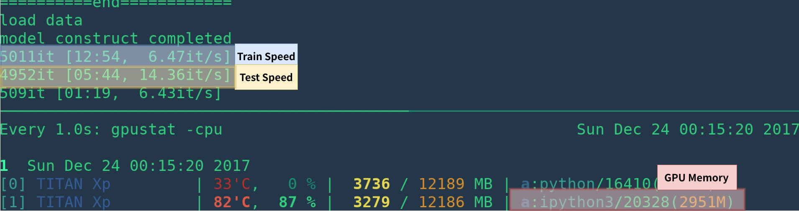
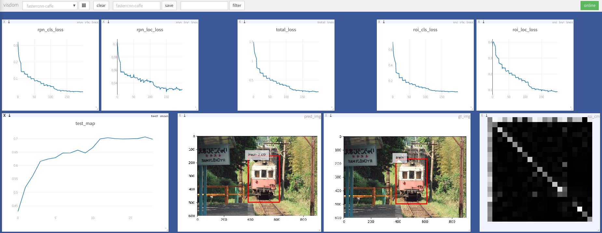
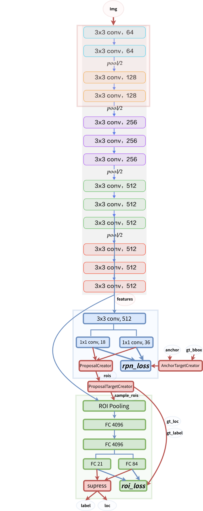

# A Simple and Fast Implementation of Faster R-CNN

## 1. Introduction

**I've update the code to support both Python2 and Python3, PyTorch 1.0. If you want the old version code please checkout branch [v0.3](https://github.com/chenyuntc/simple-faster-rcnn-pytorch/tree/0.3)**

This project is a **Simplified** Faster R-CNN implementation based on [chainercv](https://github.com/chainer/chainercv) and other [projects](#acknowledgement) . It aims to:

- Simplify the code (*Simple is better than complex*)
- Make the code more straightforward (*Flat is better than nested*)
- Match the performance reported in [origin paper](https://arxiv.org/abs/1506.01497) (*Speed Counts and mAP Matters*)

And it has the following features:
- It can be run as pure Python code, no more build affair. (cuda code moves to cupy, Cython acceleration are optional)
- It's a minimal implemention in around 2000 lines valid code with a lot of comment and instruction.(thanks to chainercv's excellent documentation)
- It achieves higher mAP than the origin implementation (0.712 VS 0.699)
- It achieve speed compariable with other implementation (6fps and 14fps for train and test in TITAN XP with cython)
- It's memory-efficient (about 3GB for vgg16)





## 2. Performance

### 2.1 mAP

VGG16 train on `trainval` and test on `test` split. 

**Note**: the training shows great randomness, you may need a bit of luck and more epoches of training to reach the highest mAP. However, it should be easy to surpass the lower bound. 

|              Implementation              |     mAP     |
| :--------------------------------------: | :---------: |
| [origin paper](https://arxiv.org/abs/1506.01497) |    0.699    |
|    train with caffe pretrained model     | 0.700-0.712 |
| train with torchvision pretrained model  | 0.685-0.701 |
| model converted from [chainercv](https://github.com/chainer/chainercv/tree/master/examples/faster_rcnn) (reported 0.706) |   0.7053    |

### 2.2 Speed

|              Implementation              |   GPU    | Inference | Trainining |
| :--------------------------------------: | :------: | :-------: | :--------: |
| [origin paper](https://arxiv.org/abs/1506.01497) |   K40    |   5 fps   |     NA     |
|                 This[1]                  | TITAN Xp | 14-15 fps |   6 fps    |
| [pytorch-faster-rcnn](https://github.com/ruotianluo/pytorch-faster-rcnn) | TITAN Xp | 15-17fps  |    6fps    |

[1]: make sure you install cupy correctly and only one program run on the GPU. The training speed is sensitive to your gpu status. see [troubleshooting](troubleshooting) for more info. Morever it's slow in the start of the program -- it need time to warm up.

It could be faster by removing visualization, logging, averaging loss etc.
## 3. Install dependencies

requires PyTorch >=0.4

- install PyTorch >=0.4 with GPU (code are GPU-only), refer to [official website](http://pytorch.org)

- install cupy, you can install via `pip install cupy-cuda80` or(cupy-cuda90,cupy-cuda91, etc).

- install other dependencies:  `pip install -r requirements.txt `

- Optional, but strongly recommended: build cython code `nms_gpu_post`: 

  ```Bash
  cd model/utils/nms/
  python build.py build_ext --inplace
  cd -
  ```

- start visdom for visualization

```Bash
nohup python -m visdom.server &
```


## 4. Demo

Download pretrained model from [Google Drive](https://drive.google.com/open?id=1cQ27LIn-Rig4-Uayzy_gH5-cW-NRGVzY) or [Baidu Netdisk( passwd: scxn)](https://pan.baidu.com/s/1o87RuXW)


See [demo.ipynb](https://github.com/chenyuntc/simple-faster-rcnn-pytorch/blob/master/demo.ipynb) for more detail.

## 5. Train

### 5.1 Prepare data

#### Pascal VOC2007

1. Download the training, validation, test data and VOCdevkit

   ```Bash
   wget http://host.robots.ox.ac.uk/pascal/VOC/voc2007/VOCtrainval_06-Nov-2007.tar
   wget http://host.robots.ox.ac.uk/pascal/VOC/voc2007/VOCtest_06-Nov-2007.tar
   wget http://host.robots.ox.ac.uk/pascal/VOC/voc2007/VOCdevkit_08-Jun-2007.tar
   ```

2. Extract all of these tars into one directory named `VOCdevkit`

   ```Bash
   tar xvf VOCtrainval_06-Nov-2007.tar
   tar xvf VOCtest_06-Nov-2007.tar
   tar xvf VOCdevkit_08-Jun-2007.tar
   ```

3. It should have this basic structure

   ```Bash
   $VOCdevkit/                           # development kit
   $VOCdevkit/VOCcode/                   # VOC utility code
   $VOCdevkit/VOC2007                    # image sets, annotations, etc.
   # ... and several other directories ...
   ```

4. modify `voc_data_dir` cfg item in `utils/config.py`, or pass it to program using argument like `--voc-data-dir=/path/to/VOCdevkit/VOC2007/` .


### 5.2 Prepare caffe-pretrained vgg16

If you want to use caffe-pretrain model as initial weight, you can run below to get vgg16 weights converted from caffe, which is the same as the origin paper use.

````Bash
python misc/convert_caffe_pretrain.py
````

This scripts would download pretrained model and converted it to the format compatible with torchvision. If you are in China and can not download the pretrain model, you may refer to [this issue](https://github.com/chenyuntc/simple-faster-rcnn-pytorch/issues/63)

Then you could specify where caffe-pretraind model `vgg16_caffe.pth` stored in `utils/config.py` by setting `caffe_pretrain_path`. The default path is ok.

If you want to use pretrained model from torchvision, you may skip this step.

**NOTE**, caffe pretrained model has shown slight better performance.

**NOTE**: caffe model require images in BGR 0-255, while torchvision model requires images in RGB and 0-1. See `data/dataset.py`for more detail. 

### 5.3 begin training

```Bash
mkdir checkpoints/ # folder for snapshots
```

```bash
python train.py train --env='fasterrcnn-caffe' --plot-every=100 --caffe-pretrain
```

you may refer to `utils/config.py` for more argument.

Some Key arguments:

- `--caffe-pretrain=False`: use pretrain model from caffe or torchvision (Default: torchvison)
- `--plot-every=n`: visualize prediction, loss etc every `n` batches.
- `--env`: visdom env for visualization
- `--voc_data_dir`: where the VOC data stored
- `--use-drop`: use dropout in RoI head, default False
- `--use-Adam`: use Adam instead of SGD, default SGD. (You need set a very low `lr` for Adam)
- `--load-path`: pretrained model path, default `None`, if it's specified, it would be loaded.

you may open browser, visit `http://<ip>:8097` and see the visualization of training procedure as below:



## Troubleshooting

- dataloader: `received 0 items of ancdata` 

  see [discussion](https://github.com/pytorch/pytorch/issues/973#issuecomment-346405667), It's alreadly fixed in [train.py](https://github.com/chenyuntc/simple-faster-rcnn-pytorch/blob/master/train.py#L17-L22). So I think you are free from this problem.
  
- Windows support
 
  I don't have windows machine with GPU to debug and test it. It's welcome if anyone could make a pull request and test it.

## More

- [ ] training on coco
- [ ] resnet
- [ ] Maybe；replace cupy with THTensor+cffi?
- [ ] Maybe：Convert all numpy code to tensor?
- [x] python2-compatibility

## Acknowledgement
This work builds on many excellent works, which include:

- [Yusuke Niitani's ChainerCV](https://github.com/chainer/chainercv) (mainly)
- [Ruotian Luo's pytorch-faster-rcnn](https://github.com/ruotianluo/pytorch-faster-rcnn) which based on [Xinlei Chen's tf-faster-rcnn](https://github.com/endernewton/tf-faster-rcnn)
- [faster-rcnn.pytorch by Jianwei Yang and Jiasen Lu](https://github.com/jwyang/faster-rcnn.pytorch).It mainly refer to [longcw's faster_rcnn_pytorch](https://github.com/longcw/faster_rcnn_pytorch)
- All the above Repositories have referred to [py-faster-rcnn by Ross Girshick and Sean Bell](https://github.com/rbgirshick/py-faster-rcnn)  either directly or indirectly. 

## ^_^
Licensed under MIT, see the LICENSE for more detail.

Contribution Welcome.

If you encounter any problem, feel free to open an issue, but too busy lately.

Correct me if anything is wrong or unclear.

model structure

